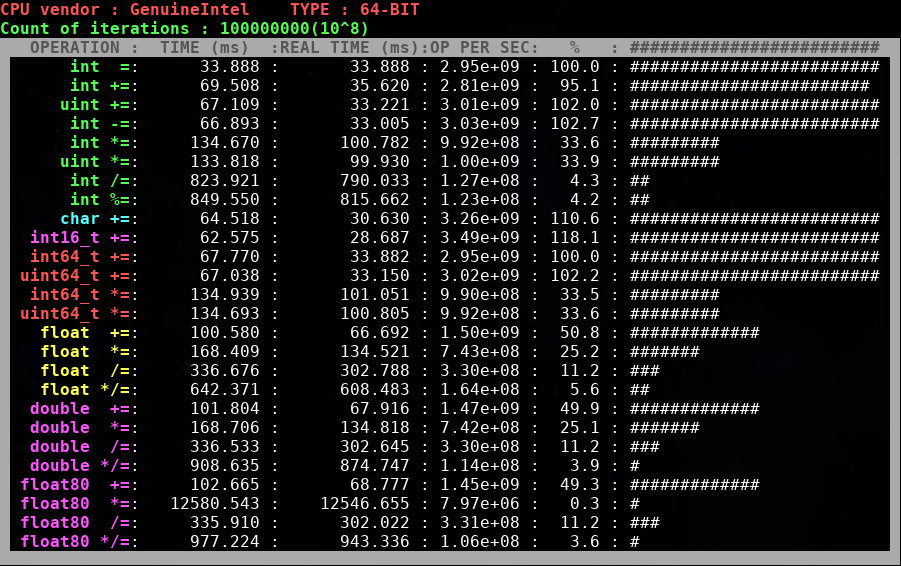
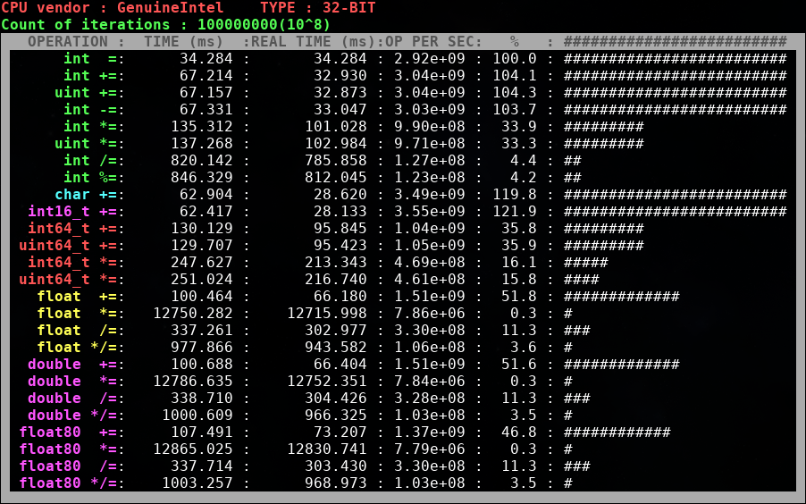

# Lab. 1 : Benchmark

Simple benchmark for comparing different operation perfomance on different primitive types.

### Usage

Just run ```make``` and then ```./main.out``` (but you need to compile it by your own on Windows). 

Now you need to wait couple of minutes (or seconds) depending on ```COUNT_OF_ITERATIONS``` constant in file ```listoftests.h```. 

### Some results

The following screenshot shows results on my laptop (Intel i5-2430M):



Results in 32-bit mode (compiling with flag ```-m32```):



This benchmark also shows the perfomance problems with value ```INF``` in float-point data types (look at the row ```float80 *=``` on the first screenshot and ```float *=```, ```double *=``` and ```float80 *=``` on the second).   